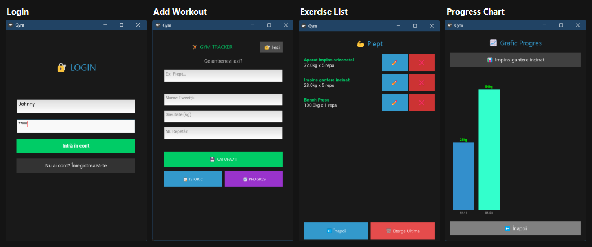

# Gym Tracker

Aplicație desktop pentru evidența antrenamentelor de sală — login pe utilizator, salvarea exercițiilor (greutate, repetări, dată), istoric și grafic de progres pe fiecare exercițiu.

Built with **Python + Kivy + SQLite**.

## Features

- Autentificare cu cont (înregistrare + login)
- Adăugare exerciții cu numele antrenamentului, greutate, număr de repetări
- Istoric complet al antrenamentelor, sortat după dată
- Editare / ștergere exerciții
- Grafic de progres pe fiecare exercițiu (ultimele 30 de înregistrări)
- Persistență locală cu SQLite

## Tech stack

| Componentă | Tool |
|---|---|
| GUI | Kivy |
| Bază de date | SQLite |
| Limbaj | Python 3.12+ |

## Structura proiectului

```
gym_tracker/
├── main.py                  # Entry point - configurează aplicația și ScreenManager
├── database/
│   └── db_manager.py        # CRUD pe SQLite: users, exercises
└── screens/
    ├── login_screen.py      # Ecran de login
    ├── register_screen.py   # Ecran de înregistrare cont
    ├── add_screen.py        # Adăugare exercițiu nou
    ├── history_screen.py    # Istoric + editare/ștergere
    └── progress_screen.py   # Grafic de progres
```

## Instalare și rulare

```bash
pip install -r requirements.txt
python main.py
```

## Modelul de date

**users** — id, username (unic), password
**exercises** — id, user_id (FK), workout_name, name, weight, reps, date

## Screenshots



De la stanga la dreapta: login, adaugare antrenament, lista exercitii pe categorie, grafic de progres pentru un exercitiu in timp.

## Posibile îmbunătățiri viitoare

- Hash pe parole (în loc de plain text)
- Export antrenamente în CSV
- Statistici agregate (volum total, PR-uri)
- Sincronizare cloud
